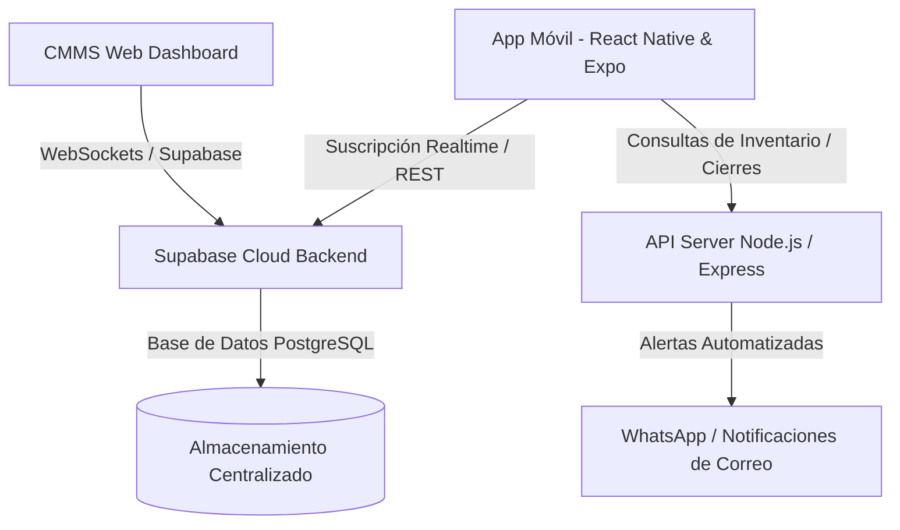

# 📱 CMMS Técnico - Aplicación Móvil de Campo
> Plataforma Móvil de Control y Gestión de Órdenes de Trabajo (OT) en Tiempo Real para Equipos de Mantenimiento Industrial.

[](https://reactnative.dev/)
[](https://expo.dev/)
[](https://supabase.com/)
[](#-diseño-y-experiencia-de-usuario-uxui)

---

## 🎯 ¿Para qué se utiliza esta Aplicación?

**CMMS Técnico** es la extensión móvil oficial de nuestra plataforma de mantenimiento. Ha sido diseñada específicamente para **técnicos de campo, supervisores e ingenieros de soporte** con el objetivo de eliminar el uso de papel en los talleres y automatizar el registro de datos directamente al pie de máquina.

Con esta aplicación, un técnico puede:
1. **Visualizar su Carga de Trabajo:** Consultar instantáneamente las órdenes de trabajo activas (**Abiertas** y **En Proceso**) asignadas a su nombre.
2. **Gestionar Mantenimientos Preventivos:** Ejecutar planes de mantenimiento preventivo interactivos marcando una lista de tareas (*checklist*) que se sincroniza dinámicamente con el servidor.
3. **Controlar el Consumo de Refacciones:** Registrar en tiempo real los materiales y piezas instaladas en cada máquina, descontando automáticamente el stock del almacén central y calculando costos de forma transparente.
4. **Cierre de Órdenes Riguroso:** Registrar tiempos exactos de reparación (calculados de forma automática), registrar la firma digital de supervisores y detallar la causa raíz de las fallas para alimentar el historial predictivo del activo.

---

## 🚀 Arquitectura Tecnológica

La aplicación está construida sobre un ecosistema de desarrollo moderno y escalable que garantiza fluidez, seguridad y consistencia en la transferencia de datos:



### 🛠️ Tecnologías Principales:
* **[React Native](https://reactnative.dev/) & [Expo (v54)](https://expo.dev/):** Framework líder para la compilación de aplicaciones móviles nativas de altísimo rendimiento tanto para Android como para iOS desde una base de código única.
* **[Supabase](https://supabase.com/):** Backend-as-a-Service (BaaS) basado en **PostgreSQL**. Utiliza el motor de **Supabase Realtime** para escuchar inserciones y actualizaciones en la base de datos y refrescar la pantalla del móvil sin que el técnico tenga que recargar la aplicación manualmente.
* **React Navigation (Native Stack):** Proporciona transiciones de pantalla 3D nativas, optimizadas para el hardware del procesador del teléfono móvil.
* **AsyncStorage:** Almacenamiento local en el dispositivo del técnico para mantener la sesión iniciada de manera segura y guardar las credenciales y foto de perfil en caché rápida.

---

## ✨ Características y Módulos Clave

### 🔒 1. Acceso Seguro (Login)
* **Diseño Futurista:** Pantalla de inicio con interfaz translúcida (*Glassmorphic Card*), burbujas de iluminación neón de fondo y animaciones fluidas.
* **Foco Estable:** Optimizado al 100% para evitar el parpadeo o cierre repentino del teclado del teléfono (diseño de renderizado estático e independiente en Android y control de altura avanzado en iOS).

### 📊 2. Panel Principal (Dashboard de OTs)
* **Contadores Dinámicos:** Tres tarjetas de visualización rápida para OTs Abiertas (Rojo), En Proceso (Ámbar) e Historial Total (Cian).
* **Tarjetas con Borde Inteligente:** Cada OT muestra visualmente su nivel de emergencia gracias a un borde izquierdo iluminado según prioridad (ej. **Prioridad P1 Emergencia** resalta en rojo neón).
* **Pull-to-Refresh:** Desliza hacia abajo para forzar una sincronización limpia con el inventario y las órdenes.

### ⚙️ 3. Detalle de Orden e Interactividad de Campo
* **Checklist Interactivo:** Casillas de verificación interactivas para planes de mantenimiento. Al marcar una tarea, esta cambia a color verde brillante y se marca con texto tachado de forma sumamente visual y satisfactoria.
* **Control de Refacciones (Materiales):**
  * Buscador rápido de refacciones integrado.
  * Validador automático de stock (avisa e inhabilita refacciones sin existencias).
  * Registro de notas de instalación para cada pieza.
  * Cálculo instantáneo de costos totales de mantenimiento en la OT.
* **Cierre Inteligente y Automatizado:**
  * **Cálculo de Tiempos Real:** Al seleccionar "Cerrada", la aplicación calcula exactamente cuántas horas transcurrieron entre la apertura de la OT y el cierre oficial del técnico.
  * **Firma Obligatoria:** Exige el ingreso del supervisor que valida y la descripción del trabajo realizado.
  * **Causa Raíz:** En correctivos, solicita obligatoriamente el origen físico de la falla.

---

## 🎨 Diseño y Experiencia de Usuario (UX/UI)

La interfaz se aleja del diseño empresarial tradicional "plano y aburrido" para adoptar un estilo **Dark Tech Premium**:
* **Color Base:** `#0a0f1d` (Azul medianoche profundo de estilo futurista).
* **Colores de Acentuación:** Cian Eléctrico (`#00bfff`), Verde Esmeralda (`#10b981`), Rojo Rubí (`#ef4444`).
* **Estilo Táctil:** Botones con un alto grado de `activeOpacity` para dar una sensación táctil súper suave y orgánica al usuario.

---

## 🛠️ Guía de Instalación y Desarrollo Local

Para correr este proyecto en tu entorno local de desarrollo:

### 1. Prerrequisitos
Tener instalado en tu equipo de desarrollo:
* [Node.js](https://nodejs.org/) (versión 18 o superior)
* [Expo Go](https://expo.dev/go) instalado en tu dispositivo móvil (Android/iOS)

### 2. Clonación y Dependencias
```bash
# Entrar a la carpeta del proyecto móvil
cd AppTecnicos

# Instalar dependencias del proyecto
npm install
```

### 3. Variables de Entorno (`.env`)
Crea un archivo `.env` en la raíz de `AppTecnicos` y agrega tus credenciales del servidor:
```ini
EXPO_PUBLIC_SUPABASE_URL=https://tu-proyecto.supabase.co
EXPO_PUBLIC_SUPABASE_ANON_KEY=tu-clave-publica-anonima
EXPO_PUBLIC_API_URL=http://<TU_IP_LOCAL>:3000/api
```

### 4. Iniciar Servidor de Desarrollo
```bash
# Iniciar Metro Bundler con limpieza de caché y túnel de desarrollo
npx expo start -c --tunnel
```
*Escanea el código QR generado en tu terminal desde la aplicación **Expo Go** en Android o con la cámara de tu iPhone en iOS para ver la aplicación corriendo en tiempo real.*

---

## ⚙️ Sincronización Automática con la Base de Datos
La aplicación móvil se conecta a la tabla `ordenes_trabajo` mediante Supabase WebSockets. Cualquier cambio realizado en el software administrativo web (como reasignar una OT o cancelar un mantenimiento) se reflejará **de forma inmediata** en el móvil del técnico sin necesidad de que este reinicie la aplicación.
